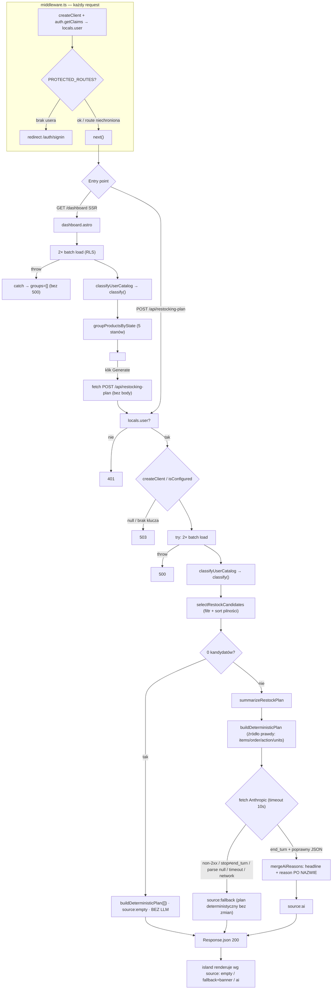

# Research: przepływ planu restockingu i klasyfikacji (Deep Focus M4L3)

**Cel (jednolinijkowo):** badam przepływ „tygodniowy plan restockingu + klasyfikacja" od `src/pages/api/restocking-plan/index.ts` (i renderu `src/pages/dashboard.astro`) w głąb rdzenia `src/lib/{classification,restocking,dashboard,services/restocking-summary}.ts`, bo mapa (`context/map/repo-map.md`) wskazała ten obszar jako strefę ryzyka 1+2 — core biznesowy o najwyższym fan-in i najsilniejszym co-change, a zarazem częściowo w martwym punkcie narzędzi (`.astro` nieparsowane).

**Data**: 2026-07-20 · **Commit**: `1224de1` · **Branch**: `test/e2e-playwright-setup`
**Metoda**: 3 równoległe sub-agenty (trace e2e / luki testowe / blast radius), każdy weryfikował twierdzenia mapy świeżym odczytem kodu. Rygor: `[E]` evidence (file:line), `[I]` inference, `[U]` unknown.

> **Zakres i granice.** To analiza stanu obecnego, nie projekt refaktoru. Mapa użyta jako **prior**, nie prawda objawiona — potwierdzana lub korygowana kodem. Twierdzenia strukturalne (liczby importerów, „tylko tutaj") są tu jeszcze **niezweryfikowane narzędziem** — to zadanie kroku ast-grep (`m4l3-2`).

---

## 1. Feature overview

### 1.1 Czym jest ten przepływ (w jednym zdaniu)

To, co z zewnątrz wygląda jak „AI generuje plan restockingu", pod spodem jest **deterministycznym silnikiem**, na którego wynik LLM nakłada wyłącznie prozę (headline + zdanie „dlaczego") — nie może zmienić ani produktu, ani ilości, ani kolejności. `[E restocking-summary.ts:111-120]`

### 1.2 Dwa entry pointy, jeden rdzeń

| Entry point                                            | Co robi                                                            | Rozgałęzienie                                             |
| ------------------------------------------------------ | ------------------------------------------------------------------ | --------------------------------------------------------- |
| `POST /api/restocking-plan` `[E index.ts:18]`          | load → classify → **select** → (empty short-circuit \| AI summary) | filtruje do `Understocked`+`Watch`, sortuje wg pilności   |
| render `dashboard.astro` (SSR) `[E dashboard.astro:9]` | load → classify → **group**                                        | grupuje wszystkie 5 stanów w `STATE_ORDER` do siatki kart |

Oba wołają ten sam `classifyUserCatalog` (`lib/dashboard.ts`) → `classify` (`lib/classification.ts`); rozjeżdżają się dopiero na końcowej projekcji (`selectRestockCandidates` vs `groupProductsByState`). `[E index.ts:36 vs dashboard.astro:24]`

### 1.3 Ścieżka end-to-end (kroki kluczowe)

Wspólny prolog (każdy request): `middleware.ts` tworzy request-scoped klienta Supabase, waliduje JWT lokalnie przez `auth.getClaims()` (bez sieci) i ustawia `locals.user`; route guard chroni `/dashboard /products /account`. `[E middleware.ts:6-36]`

Ścieżka API:

1. `locals.user` puste → **401** `[E index.ts:20]`
2. `createClient` null → **503** (Supabase) `[E index.ts:26]`
3. `isConfigured()` (brak `ANTHROPIC_API_KEY`) → **503** (AI) — bramka _przed_ pracą na DB `[E index.ts:29-31]`
4. `try`: dwa **batchowe** zapytania `getProductsByUser` + `getSalesEntriesByUser` (bez N+1, RLS skopowane po userze) `[E index.ts:34-35, db.ts:6-15,78-87]`
5. `classifyUserCatalog` grupuje sales-entries w `Map<product_id, SalesEntry[]>` jednym przejściem, potem `classify` per produkt `[E dashboard.ts:19-30]`
6. `selectRestockCandidates` filtruje i sortuje wg `urgency = daysOfStock − leadTime` (stabilny sort; Understocked przez ujemny zapas trafia przed Watch) `[E restocking.ts:45-79]`
7. **empty short-circuit**: 0 kandydatów → `buildDeterministicPlan([])`, `source:"empty"`, **żadnego wywołania LLM** `[E index.ts:39-41]`
8. inaczej `summarizeRestockPlan`: buduje deterministyczny plan **najpierw**, potem fetch do Anthropic (`claude-haiku-4-5`, timeout 10 s przez `AbortController`), z fallbackiem na każdą awarię `[E restocking-summary.ts:132-178]`
9. `catch` w route: `AiUnconfiguredError` → 503, każdy inny błąd (realnie tylko throw z DB) → **500** `[E index.ts:45-51]` `[I: 500 osiągalne praktycznie tylko przez krok 4]`

Silnik `classify` — drabina ewaluacji w stałej kolejności: `Insufficient data` (<7 dni) → `Understocked` (zapas < lead time; wygrywa z Slow-mover) → `Slow-mover` (velocity <0.1 lub ≥90 dni zapasu) → `OK` (brak lead time) → `Watch`/`OK` (pasma lead-time). `[E classification.ts:122-177]`

### 1.4 Diagram przepływu

### 1.5 Gdzie struktura myli (trace ≠ drzewo katalogów)

- **Nazwa `restocking-summary` / endpoint `restocking-plan` przecenia AI.** LLM to ostatni, opcjonalny, nieautorytatywny krok; wszystkie decyzje biznesowe zapadają w czystym silniku przed jego wywołaniem. `[E restocking-summary.ts:135]`
- **`POST /api/restocking-plan` NIE jest w `PROTECTED_ROUTES`** — wygląda na chroniony middlewarem jak `/dashboard`, ale broni się sam (401 w handlerze). `[E middleware.ts:4, index.ts:20-22]`
- **Pojedyncze wejście na dashboard NIE generuje planu ani nie pali tokenów** — SSR renderuje tylko siatkę klasyfikacji; plan to osobny, ręcznie wyzwalany POST z wyspy React. `[E dashboard.astro:71, RestockingPlan.tsx:33-38]`
- **LLM jest strukturalnie zamknięty w prozie** przez trzy nakładające się bariery: `PLAN_SCHEMA` (`additionalProperties:false`, tylko `headline`+`items[{product,reason}]`), total `parsePlanResponse` (null → fallback), oraz `mergeAiReasons` iterujący po itemach silnika (halucynowany produkt jest po cichu odrzucany). `[E restocking-summary.ts:18-37,73-102,111-120]`

**Wniosek:** dostaliśmy przepływ, nie spis plików — wiadomo skąd wchodzą dane (2 batch queries), kto liczy stan (silnik), gdzie AI może i nie może namieszać, i co wraca (`source: empty|ai|fallback`).

---

## 2. Technical debt

Nie lista „brzydkich plików", lecz **mapa kruchości**: gdzie zmiana może cicho zepsuć dane/kontrakt, gdzie brak siatki bezpieczeństwa, a gdzie ryzyko jest tylko pozorne.

### 2.1 Luki testowe (siatka bezpieczeństwa) — najgroźniejsze najpierw

Rdzeń klasyfikacji to **najlepiej chroniony kod w repo** (gęste testy + bramka mutacyjna Stryker), ale pokrycie urywa się na granicy I/O i AI.

| Obszar                                                     | Pokrycie                                           | Ryzyko                                                                                                                                             |
| ---------------------------------------------------------- | -------------------------------------------------- | -------------------------------------------------------------------------------------------------------------------------------------------------- |
| `classify` + helpery velocity `[E classification.test.ts]` | wszystkie stany, granice, mutanty (`<`/`<=`, ceil) | **Niskie** — jedyny cel Stryker `[E stryker.conf.json:7]`                                                                                          |
| `selectRestockCandidates` / `groupProductsByState`         | filtr, sort, kolejność, empty                      | Niskie                                                                                                                                             |
| `parsePlanResponse` / `mergeAiReasons`                     | happy + null-branche + drop halucynacji            | Niskie                                                                                                                                             |
| **`summarizeRestockPlan`** `[E restocking-summary.ts:132]` | **ZERO**                                           | **WYSOKIE** — cały łańcuch fallbacku (`!res.ok`, `stop_reason≠end_turn`, unparseable, network/timeout, abort) i ścieżka `source:"ai"` nietestowane |
| **`POST /api/restocking-plan`** `[E index.ts:18]`          | **ZERO** (brak unit/integ/e2e)                     | **WYSOKIE** — 5 kontraktów statusu (401/503×2/500/200-empty/200) nieweryfikowanych                                                                 |
| `urgency()` null-facts `[E restocking.ts:46]`              | branch `+Infinity` nietrafiony                     | **Średnie** — refaktor guardu mógłby zepsuć „most urgent first" bez czerwonego testu                                                               |
| `deterministicReason` null-facts + `dos===1`               | fallbacki i singular nietestowane                  | Średnie — to user-visible copy dokładnie gdy AI padło                                                                                              |
| `isConfigured` `[E restocking-summary.ts:57]`              | oba branche nietestowane                           | Średnie — bramka 503                                                                                                                               |

**Najgroźniejsze:** `summarizeRestockPlan` i endpoint są nietestowane, a to **dokładnie ten szew, na którym żyje gwarancja „AI nie zmienia decyzji silnika"** oraz kontrakt HTTP. Klocki (`parsePlanResponse`, `mergeAiReasons`) są testowane, ale ich **kompozycja + wiring fetch/abort — nie**. Mutacja pokrywa tylko `classification.ts` `[E stryker.conf.json:7]` i **nie jest wpięta w CI** `[E stryker.conf.json:3]`. E2E (`e2e/*.spec.ts`) dotyka tylko auth i produktów — **nie ten endpoint**. `[E]`

### 2.2 Blast radius — co naprawdę zmienia się razem

**Prawdziwe sprzężenie ręczne (realny koszt zmiany):**

1. **Szew kontraktu danych — 4 miejsca lustrzane, bez generatora.** Zmiana pola `Product`/`SalesEntry` wymaga ręcznej synchronizacji: migracja Supabase (append-only, nowy plik) → `types.ts` → `validation/{product,sales-entry}.ts` (zod) → `db.ts` (casty `as Product`) → konsumenci czytający pole (`classification.ts` itd.). `[E types.ts:3-22, validation/product.ts:16-31, db.ts]` **Dowód, że szew realnie „strzela":** migracja `20260606000001_...allow_zero_units` poluzowała `units_sold > 0` → `>= 0`, a zod zmieniono na `.nonnegative()` w tym samym feature (commit `088aa63`). `[E git]`
   - ⚠️ **`[U]` pułapka:** plik `create_sales_entries.sql:8` wciąż pokazuje `CHECK (units_sold > 0)`, bo nadpisuje go późniejsza migracja — kto zdiffuje tylko migrację tworzącą, odczyta constraint błędnie.
2. **Klaster kontraktu AI:** `restocking.ts` → `restocking-summary.ts` → `RestockingPlan.tsx` (kształt `RestockPlan`/`headline`). Dowód: commit `c6352d6` (`rename weekly_summary → headline`) ruszył wszystkie trzy + oba testy naraz. `[E git c6352d6]`
3. **Pary silnik ↔ test (TDD lockstep):** każdy commit silnika rusza `.ts` i `.test.ts` razem (3/3 dla restocking i summary, 2/2 dla classification). `[E git]`
4. **Composition root** `index.ts` importuje wszystkie cztery moduły `[E index.ts:3-6]` — każda zmiana sygnatury silnika wymusza edycję tutaj.

**Tanie sprzężenie „przez regenerację / proces" (NIE dług — nie mylić):**

- `package-lock.json`, generowane `dependency-*.svg` (`npm run depcruise:*`), `.claude/.10x-cli-manifest.json`, artefakty procesu 10x (`context/changes/**`, `CLAUDE.md`) — współwystępują z powodu **rozmiaru commita / regeneracji**, nie zależności. Mega-commity (scaffold 96 plików, `product-catalog-crud` 47) zawyżają każdy co-change. `[E artifact-1:103-111, git 7873126/0fd601c]`

### 2.3 Korekty priora (mapa jako prior, nie prawda) — `.astro` zaniża fan-in

Sub-agent blast radius potwierdził wprost martwy punkt z „Ograniczeń" mapy: dependency-cruiser nie parsuje `.astro`, więc realny fan-in jest wyższy niż w artifact-2. Liczby poniżej **potwierdzone `grep` co do jednego importera** (patrz sekcja 3):

| Moduł                   | artifact-2 (Ca)  | Zweryfikowane (grep)                                 | Różnica                |
| ----------------------- | ---------------- | ---------------------------------------------------- | ---------------------- |
| `types.ts`              | 13               | **16** (10 prod + 3 `.astro` + 3 test)               | +3 `.astro`            |
| `db.ts`                 | 5                | **8** (5 prod + 3 `.astro`, w tym `dashboard.astro`) | +3 `.astro`            |
| `classification.ts`     | 9                | **11** (6 prod + 2 `.astro` + 3 test)                | +2 `.astro`            |
| `restocking.ts`         | 5                | **5**                                                | zgodne (brak `.astro`) |
| `dashboard.ts`          | — (nie w tabeli) | **5** (2 prod + 1 `.astro` + 2 test)                 | luka priora            |
| `validation/product.ts` | 5                | **5**                                                | zgodne                 |

Dodatkowo: `dashboard.ts` **nie jest** wylistowany jako hub w artifact-2, a leży na ścieżce krytycznej (jego typ `ProductClassification` konsumuje `restocking.ts`) — luka priora. `[E grep]`

---

## 3. Weryfikacja strukturalna (ast-grep + grep) — krok m4l3-2

Zasada z lekcji: **licz `ast-grep`em dla precyzji, każde zero/lukę zderz z `grep`em.** Tu żadne „zero" nie okazało się realnym brakiem — luki ast-grep były granicą narzędzia (`.astro`/`.tsx` przy `-l ts`), złapane grepem.

| Twierdzenie z raportu                                                         | Werdykt                                | Dowód                                                                                                                                                              |
| ----------------------------------------------------------------------------- | -------------------------------------- | ------------------------------------------------------------------------------------------------------------------------------------------------------------------ |
| Fan-in `types.ts` = 13 (artifact-2)                                           | **doprecyzowane → 16**                 | grep: 10 prod + 3 `.astro` + 3 test; artifact-2 pomija `.astro`                                                                                                    |
| Fan-in `db.ts` = 5                                                            | **doprecyzowane → 8**                  | grep: +3 `.astro` (w tym `dashboard.astro`)                                                                                                                        |
| Fan-in `classification.ts` = 9                                                | **doprecyzowane → 11**                 | grep: +2 `.astro` (`products/[id].astro`, `ProductCard.astro`)                                                                                                     |
| Fan-in `restocking.ts` = 5                                                    | **potwierdzone**                       | grep + ast-grep zgodne, brak `.astro`                                                                                                                              |
| `classify()` to wspólny silnik wołany server-side w wielu miejscach           | **potwierdzone → 5 call-site'ów prod** | ast-grep `classify($$$)` [ts]: `dashboard.ts:29`, `sales-entries/[entryId].ts:38`, `sales-entries/index.ts:46,108` (4); grep dołożył `products/[id].astro:25` (5.) |
| „słowa rekomendacji z jednego źródła, nie forkują się" (`recommendationText`) | **potwierdzone → 3 call-site'y prod**  | ast-grep [ts]: `restocking.ts:65`; grep: `ClassificationPanel.tsx:33`, `ProductCard.astro:13` — wszystkie przez jedną funkcję                                      |
| `create_sales_entries` ma `CHECK (units_sold > 0)` (pułapka diffu)            | **potwierdzone**                       | `create:5` = `> 0`; migracja `allow_zero_units` robi DROP + `>= 0`                                                                                                 |

**Meta-obserwacja (ast-grep vs grep) — sedno lekcji:**

- **ast-grep precyzyjny:** odróżnił `classify(` od `classifyUserCatalog(` (inny węzeł identyfikatora) i **zignorował komentarze** `classify()` w `dashboard.ts:12,44`, które `grep` złapał jako fałszywe trafienia.
- **ast-grep wybredny/ślepy:** przy `-l ts` **pominął `.astro` i `.tsx`** (call-site `products/[id].astro:25`, importy w `ClassificationPanel.tsx`) — dokładnie ta granica, dla której `grep` jest uczciwym backstopem. Gdyby czytać samo ast-grep, fan-in i liczba call-site'ów byłyby zaniżone.

Wniosek: liczby z sekcji 2.3 są teraz **potwierdzone**, nie inferowane; korekta priora (mapa zaniżała `.astro`) jest twarda.

## Code References

- `src/pages/api/restocking-plan/index.ts:18-51` — composition root: guardy 401/503, empty short-circuit, catch→500
- `src/lib/classification.ts:122-177` — silnik `classify` (drabina 5 stanów)
- `src/lib/restocking.ts:45-124` — `urgency`/`selectRestockCandidates`/`deterministicReason`/`buildDeterministicPlan`
- `src/lib/services/restocking-summary.ts:73-178` — parse/merge/summaryze + fallback (nietestowane)
- `src/lib/dashboard.ts:19-66` — `classifyUserCatalog` + `groupProductsByState` (wspólny rdzeń)
- `src/pages/dashboard.astro:14-30` — druga ścieżka wejścia (SSR)
- `src/middleware.ts:4-38` — auth + route guard (endpoint NIE w PROTECTED_ROUTES)
- `src/types.ts:1-22` — hub kontraktu (Product, SalesEntry, ClassificationState)

## Historical Context (from prior changes)

- `context/archive/*testing-velocity-engine-correctness*` — kampania utwardzania `classification.ts` (mutanty Stryker, OG-1/OG-2)
- commit `088aa63` (`sales-entry-and-classification … allow zero-sales units`) — szew migracja↔zod odpalony w praktyce
- commit `c6352d6` (`rename weekly_summary → headline`) — szew kontraktu AI odpalony w praktyce
- `context/changes/ai-weekly-restocking-plan/research.md` — starszy greenfield research punktu integracji LLM (2026-06-07), prior tego przepływu

## Open Questions

1. ✅ **Zamknięte (sekcja 3).** Liczby importerów `types.ts`(16)/`db.ts`(8)/`classification.ts`(11) potwierdzone grepem; artifact-2 zaniżał o konsumentów `.astro`.
2. **[U] pozostaje otwarte.** Czy `urgency()` null-facts jest realnie osiągalny w produkcji (Watch/Understocked z `daysOfStock=null`)? To pytanie o zachowanie w runtime, nie o strukturę — ast-grep nie rozstrzyga; wymaga analizy danych/e2e. Zostaje jako `unknown`.
3. ✅ **Zamknięte (sekcja 3).** `create_sales_entries` ma `CHECK (units_sold > 0)`; `allow_zero_units` robi DROP + `>= 0`. Pułapka diffu potwierdzona.
4. ✅ **Zamknięte (sekcja 3).** `classify()` = 5 call-site'ów prod, `recommendationText()` = 3, wszystkie przez jedną funkcję — „nie forkuje się" potwierdzone.

## Następny krok

Krok 4 lekcji: **stop przed refaktorem.** Wynik to ten `research.md` (② Feature overview + ③ Technical debt), zweryfikowany ast-grep/grep — gotowy jako wejście do lekcji o refaktoryzacji (M4L4). Nie wybieramy jeszcze docelowej architektury.
