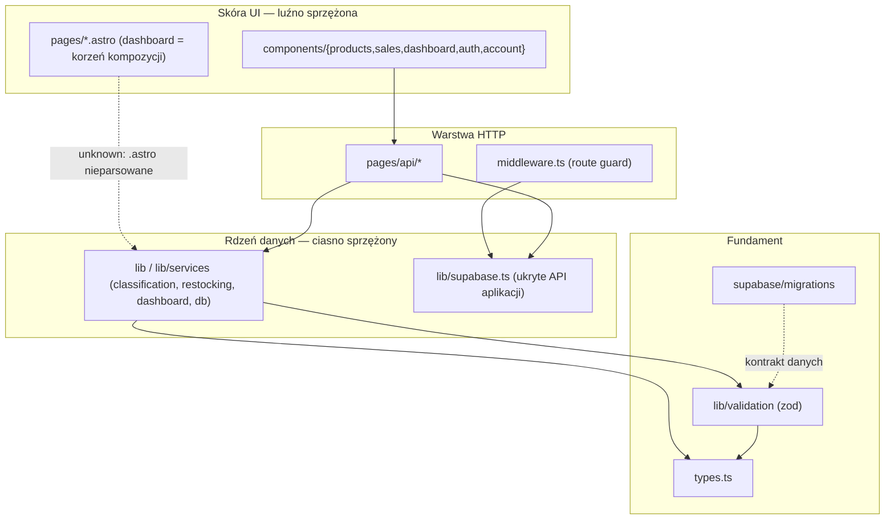

# Repo Map — onboarding

> Synteza trzech perspektyw: **gdzie żyje system** (artifact-1, historia gita) →
> **jak jest powiązany** (artifact-2, graf importów) → **kogo zapytać / co udokumentować** (artifact-3, kontrybutorzy).
> Cel: po ~15 min czytania wiesz, gdzie rzeczy żyją, co jest niebezpieczne i od czego zacząć.
> Szczegóły i tabele źródłowe — w `artifact-1-territory.md`, `artifact-2-structure.md`, `artifact-3-contributors.md`.

## 1. TL;DR

To młoda aplikacja **StockHelper** — Astro 6 SSR + React 19 islands, Supabase (auth + DB), Tailwind, deploy na Cloudflare Workers.
Cała historia mieści się w ~5 tygodniach (69 commitów, faza MVP), więc „ostatnie 12 miesięcy" = **całe życie projektu**.
Kod dzieli się na ciasno sprzężony **rdzeń danych** (`db → validation → lib → api`) i luźno sprzężoną **skórę UI** (komponenty per-domena).
Praca skupia się na trzech pionach biznesowych — **produkty (katalog)**, **sprzedaż + klasyfikacja**, **restocking/dashboard** — nad wspólnym fundamentem `src/lib` + `src/types.ts`.
Struktura jest zdrowa (0 cykli, 0 martwego kodu poza jednym stubem); główny dług nie jest strukturalny, lecz **testowalny i wiedzowy**.
Boli w dwóch miejscach: **bus factor = 1** (jeden autor, cała wiedza w jego głowie + `plan.md`) oraz **martwy punkt narzędzi** — strony `.astro` nie są parsowane przez graf zależności, więc ich powiązania to `unknown`.



## 2. Teren — gdzie żyje system

**Duża odpowiedzialność (rdzeń, ruszaj ostrożnie):**

- `src/lib` + `src/lib/services` — logika domenowa (classification, restocking, dashboard, db). Potwierdzony rdzeń **dwiema metodami**: hot-spot historii **i** wysoki fan-in.
- `src/types.ts` — fundament DTO/encji, najwyższy fan-in (Ca 13, realnie wyższy).
- `src/lib/supabase.ts` — klient auth/DB, 10 importerów (middleware + każdy endpoint).

**Peryferia (bezpieczniejsze, lokalne zmiany):**

- `src/components/products` — pionowo izolowany, sprzęga się głównie wewnątrz własnego pionu (+`components/ui`), nie w poprzek architektury.
- `src/components/ui` — współdzielony liść (button, dialog), nie sięga do `lib/services`.

**Moduły głębokie** (mały interfejs, dużo wewnątrz): silniki `classification.ts` i `restocking.ts` — jedyny obszar z osobnym cyklem utwardzania (testy Vitest, mutacje Stryker).
**Moduły płytkie** (dużo zależności, cienka logika): komponenty o wysokim fan-out — `ProductCatalog.tsx` (Ce 8), `ProductDetail.tsx` (Ce 7). Kandydaci na E2E, nie unit.

**Aktywność w czasie** (granulacja tygodniowa — kwartalna zdegenerowana):
łuk `UI/strony → logika/API → testy jednostkowe serwisów → UI finish + E2E`.
Szczyt w W26 (28 commitów, wejście `e2e/`); najświeższa aktywność to warstwa testowa (spójne z gałęzią `test/e2e-playwright-setup`).

## 3. Realne powiązania — co naprawdę zmienia się razem

**Dominujący klaster — pionowy „data plane"** (źródło: **co-change gita** + **graf importów**, zgodne):

```
supabase/migrations → lib/validation → lib/db.ts → lib → pages/api
```

Zmiana kontraktu danych propaguje się przez całą oś. Najsilniejsza para co-change: `api`+`lib` (6×). `src/pages/api` to **hub sprzężeń, nie liść** — końcówka łańcucha, dobra na testy kontraktowe.

**Cykle:** brak (0 w `no-circular`). Czysta hierarchia warstw, brak importów „w górę".

**Gdzie struktura katalogów ≠ realna aktywność:**

- `src/pages/dashboard.astro` leży w `pages/` jak zwykła strona, ale jest **korzeniem kompozycji** i najczęściej zmienianym plikiem (7 zmian) — agreguje trzy piony. Sprzężenie zdrowe, ale wysokie.
- `src/types.ts` wygląda jak zwykły plik typów, a jest fundamentem o zasięgu 13+ modułów — jego waga nie wynika z lokalizacji.

**Sprzężenie „przez regenerację / proces", nie ręczną edycję** (tańsze, inaczej waży koszt zmiany):

- Pliki najbardziej cross-cutting w historii (`package.json`, `CLAUDE.md`, `.10x-cli-manifest.json`, `roadmap.md`) współzmieniają się bo są **procesowe / generowane**, nie z ukrytej zależności kodu. Liczby zawyżone przez dwa mega-commity (scaffold 96 plików, CRUD 47) — artefakt wielkości commita.
- Artefakty wizualne grafu (`dependency-*.svg`) są **regenerowane** (`npm run depcruise:*`) — traktuj jak output, nie źródło.
- Aplikacja **nie ma** i18n ani warstwy generowanego klienta — brak ukrytego huba tłumaczeń/bundle.

**`unknown` — czego graf nie objął (nie „brak powiązań"):**

- Strony `.astro` — dependency-cruiser nie parsuje frontmattera, więc importy stron **nie są ekstrahowane**. Fan-in modułów konsumowanych tylko przez `.astro` jest **zaniżony** (`types.ts`, `supabase.ts` realnie ważniejsze). Powiązania warstwy stron = `unknown`, nie zero.
- Moduły wirtualne Astro (`astro:env/server`, `astro:middleware`) — poza grafem, rozwiązywane w buildzie (oczekiwane).

## 4. Strefy ryzyka

| #   | Strefa                                                             | Dlaczego ryzyko                                                                                             |
| --- | ------------------------------------------------------------------ | ----------------------------------------------------------------------------------------------------------- |
| 1   | Rdzeń domenowy `lib/{classification,restocking}`                   | Reguły biznesowe (progi, kryteria pilności) nie do wyczytania z kodu; wysoki fan-in + hot-spot.             |
| 2   | Oś kontraktu danych (`migrations → validation → db → api`)         | Najsilniejszy co-change; zmiana schematu kaskaduje przez całą oś; intencje RLS to wiedza projektowa.        |
| 3   | `src/types.ts`                                                     | Najwyższy blast radius (Ca 13+), a powstał w **1 commicie** — najniższa udokumentowana intencja vs zasięg.  |
| 4   | Auth (`supabase.ts` + `middleware.ts` + `api/auth`)                | „Ukryte API" (10 importerów), wrażliwe bezpieczeństwem (sesje cookie, JWT `getClaims`, `PROTECTED_ROUTES`). |
| 5   | Korzeń kompozycji UI (`dashboard.astro` + komponenty high-fan-out) | Martwy punkt obu analiz (`.astro` `unknown`); najczęściej zmieniany plik; pamięć autora jedynym źródłem.    |
| 6   | Integracja AI (serwis Anthropic + wiring sekretów)                 | Kontrakt AI (`prioritize + explain`) zmieniany przez impl-review; sekrety w `.dev.vars`; poza grafem TS.    |

## 5. Kogo zapytać

**Uwaga: bus factor = 1.** `git shortlog` pokazuje 4 tożsamości, ale to **jedna osoba** (Maciej Machaj — dwie maszyny LAN, GitHub tylko do merge'y własnych PR, MacBook). Boty: brak. AI: 64/69 commitów z asystą Claude, ale każdy ma ludzkiego autora — repo w całości human-authored.

„Kogo zapytać" oznacza tu w praktyce **„co udokumentować, zanim wiedza wyparuje"**. Realna druga linia wsparcia to artefakty procesu 10x — `context/archive/*/plan.md` i zapisy impl-review.

| Strefa            | Kontakt       | Zamiennik rozmowy (gdy autor niedostępny)                                   |
| ----------------- | ------------- | --------------------------------------------------------------------------- |
| 1. Rdzeń domenowy | Maciej Machaj | kampania `testing-velocity-engine-correctness`, testy `*.test.ts` jako spec |
| 2. Oś danych      | Maciej Machaj | `plan.md` zmiany `supabase-schema-and-types`, migracje z komentarzami RLS   |
| 3. `types.ts`     | Maciej Machaj | `plan.md` `supabase-schema-and-types` (jedyne źródło intencji)              |
| 4. Auth           | Maciej Machaj | impl-review CSRF/SameSite, fix `getClaims` w middleware                     |
| 5. UI / dashboard | Maciej Machaj | brak grafu — czytaj kod stron bezpośrednio                                  |
| 6. Integracja AI  | Maciej Machaj | commit `prioritize + explain`, rename `weekly_summary → headline`           |

## 6. Pierwszy dzień — 5–8 plików do przeczytania

Od szerokiego obrazu do konkretu:

1. **`CLAUDE.md`** — konwencje, komendy, architektura w pigułce (kontrakt pracy w tym repo).
2. **`src/types.ts`** — słownik encji/DTO; wszystko inne odwołuje się do tych typów.
3. **`src/lib/supabase.ts`** — „ukryte API aplikacji"; jak powstaje klient auth/DB, którego używa cała warstwa HTTP.
4. **`src/middleware.ts`** — route guard, `PROTECTED_ROUTES`, resolwowanie usera do `locals`.
5. **`src/lib/classification.ts`** (+ `.test.ts`) — najgłębszy silnik domenowy; test czytaj jako specyfikację reguł.
6. **`src/lib/restocking.ts`** (+ `src/lib/services/restocking-summary.ts`) — drugi silnik; deterministyczne uzasadnienie i porządek pilności.
7. **`src/pages/dashboard.astro`** — korzeń kompozycji; jak trzy piony spinają się w jeden ekran (i dlaczego to hot-spot).
8. **`src/components/products/ProductCatalog.tsx`** — reprezentatywny komponent-liść o wysokim fan-out; wzorzec React island + gdzie jest granica UI.

## 7. Ograniczenia

- **Okno czasowe:** cała historia to ~5 tygodni (2026-05-30 → 2026-07-01), 69 commitów. „12 miesięcy" = całe repo. Wnioski o „aktywności" opisują fazę MVP, nie ustabilizowany produkt.
- **Metoda:** to mapa **aktywności** (co-change gita) i **struktury** (statyczny graf importów `.ts/.tsx`) — nie mapa jakości, poprawności ani pokrycia funkcjonalnego.
- **Martwy punkt — `.astro`:** graf nie parsuje stron; ich powiązania to `unknown`. Fan-in `types.ts`/`supabase.ts` realnie wyższy niż w tabelach.
- **Zawyżone co-change:** dwa mega-commity (96 i 47 plików) napompowały „sprzężenia" cross-cutting — to artefakt wielkości commita. Przyszłe analizy powinny filtrować commity > ~40 plików.
- **Czego mapa NIE mówi:** czy reguły biznesowe są poprawne, czy testy pokrywają właściwe przypadki, jak zachowuje się app pod obciążeniem, ani nic o warstwie AI/sekretach poza grafem TS. To ustala się kodem i rozmową z autorem, nie tą mapą.
